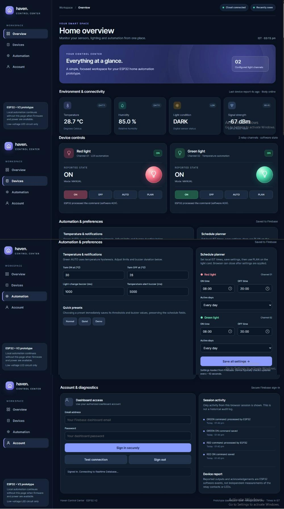
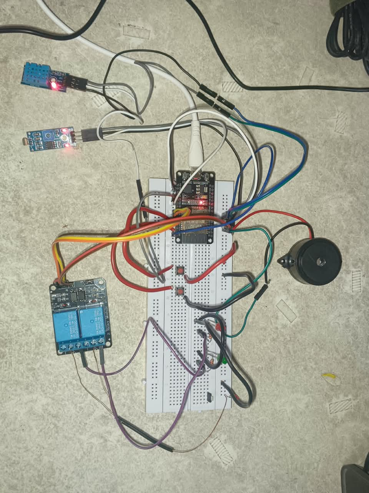
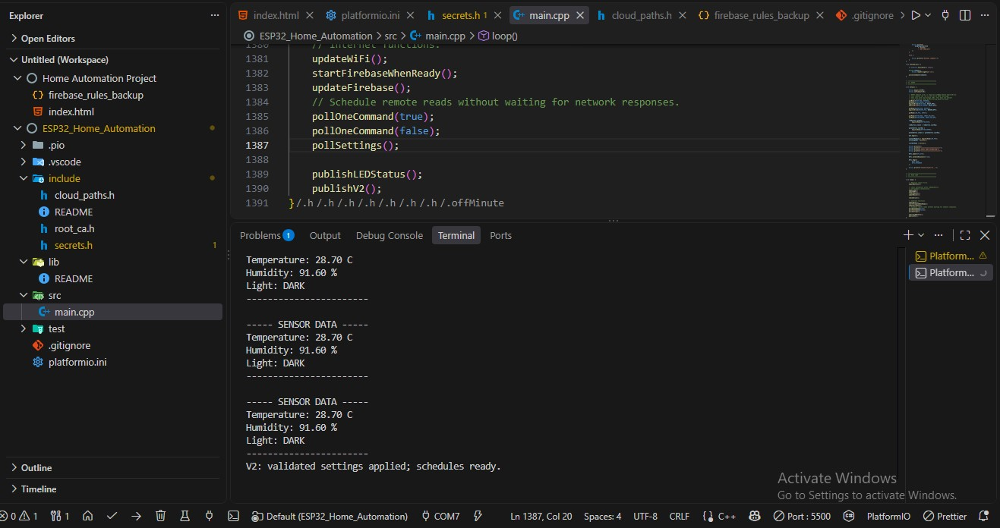

# Smart Home Automation

**An IoT-based home automation system using ESP32, Firebase Realtime Database, and a professional web dashboard.**

The system supports remote control, sensor-based automation, physical push buttons, scheduled operation, and live monitoring.

---

## Project Preview

### 1. Professional Web Dashboard



### 2. Hardware Prototype



### 3. Serial Monitor



---

## Features

- Remote ON/OFF control through a web dashboard
- Physical push-button control
- Automatic lighting using an LDR sensor
- Temperature-based automation using DHT11
- Daily scheduling
- Live temperature and humidity monitoring
- Light status monitoring
- Wi-Fi signal monitoring
- Adjustable temperature thresholds
- Configurable buzzer notifications
- Normal, Quiet, and Demo presets
- Firebase Authentication
- Firebase command acknowledgement
- Wi-Fi and Firebase reconnection

---

## Hardware Components

| Component | Purpose |
|---|---|
| ESP32 | Main microcontroller |
| DHT11 | Temperature and humidity sensor |
| Digital LDR module | Light detection |
| 2-channel relay module | Controls two LED circuits |
| Red LED | Demonstration output 1 |
| Green LED | Demonstration output 2 |
| Push buttons | Physical manual control |
| Buzzer | Audio notifications |
| Resistors | LED current limiting |
| Breadboard and wires | Prototype connections |

---

## GPIO Configuration

| Component | ESP32 GPIO |
|---|---|
| DHT11 DATA | GPIO4 |
| LDR Digital Output | GPIO16 |
| Red Relay | GPIO18 |
| Green Relay | GPIO19 |
| Red Push Button | GPIO21 |
| Green Push Button | GPIO22 |
| Buzzer | GPIO23 |

Relay trigger polarity and COM/NO/NC connections must match the actual hardware.

---

## Technologies Used

**Hardware**
- ESP32
- DHT11
- LDR
- Relay module

**Software**
- Visual Studio Code
- PlatformIO
- Arduino Framework
- Embedded C++
- HTML
- CSS
- JavaScript
- Firebase Authentication
- Firebase Realtime Database

---

## System Architecture

```text
               WEB DASHBOARD
              HTML / CSS / JS
                     |
                     |
             Firebase Authentication
                     |
                     v
            Firebase Realtime Database
                     |
                     |
                   ESP32
                     |
          +----------+----------+
          |          |          |
         DHT11      LDR      Buttons
                     |
              Output Control
                     |
            +--------+--------+
            |                 |
         Relay 1           Relay 2
            |                 |
         Red LED          Green LED
                     |
                   Buzzer
```

The dashboard sends commands to Firebase.

The ESP32 reads those commands, processes sensor data, and controls the relay outputs.

The ESP32 also publishes sensor readings and software-reported output states to Firebase.

The dashboard displays this information in real time.

---

## Operating Modes

### 1. Manual Mode

Users can control the LEDs using:

- Physical push buttons
- Web dashboard ON/OFF controls

### 2. Automatic Mode

**Red LED**

Controlled by the LDR sensor.

- DARK: Red LED ON
- BRIGHT: Red LED OFF

**Green LED**

Controlled using DHT11 temperature readings.

The configurable ON and OFF thresholds provide hysteresis to reduce repeated switching.

### 3. Schedule Mode

Users can configure:

- ON time
- OFF time
- Active days

Schedules are processed by the ESP32 using its synchronized clock.

---

## Dashboard Features

The responsive dashboard includes:

- Secure account login
- Red LED control
- Green LED control
- Temperature display
- Humidity display
- Light status
- Wi-Fi signal strength
- Device heartbeat
- Automatic control
- Schedule configuration
- Buzzer settings
- Preset selection
- Command acknowledgement

Dashboard source code:

`Dashboard/index.html`

---

## Project Structure

```text
Smart-Home-Automation/
|
|-- Dashboard/
|   |-- index.html
|
|-- src/
|   |-- main.cpp
|
|-- include/
|   |-- cloud_paths.h
|   |-- root_ca.h
|
|-- lib/
|
|-- test/
|
|-- platformio.ini
|
|-- .gitignore
|
|-- README.md
|
|-- Dashboard.jpg
|
|-- Project-Setup.jpeg
|
|-- Serial-monitor.jpeg
```

The local `include/secrets.h` file is intentionally excluded from GitHub.

---


## Testing

The prototype was tested for the following functions:

| Test | Result |
|---|---|
| Physical button control | Passed |
| Remote ON/OFF control | Passed |
| Automatic LDR control | Passed |
| Temperature automation | Passed |
| Live sensor readings | Passed |
| Schedule operation | Passed |
| Preset settings | Passed |
| ESP32 restart and reconnection | Passed |

These results represent functional testing of the low-voltage prototype, not certification for production use.

---

## Security

Private information must never be committed to a public repository.

The `.gitignore` file excludes:

```gitignore
.pio/
include/secrets.h
**/secrets.h
.env
.env.*
```

Firebase Authentication and Realtime Database security rules restrict access to authorized accounts.

Never place Wi-Fi passwords or Firebase device-account passwords inside the browser dashboard.

Check screenshots for sensitive information before publishing them.

---

## Safety Notice

This project is intended for educational purposes and low-voltage LED demonstration.

It is not designed or tested to control household AC appliances.

Disconnect power before modifying prototype wiring.

---

## Future Improvements

Potential improvements include:

- Dedicated PCB design
- Custom enclosure
- Additional sensors
- Improved fault detection
- More detailed device diagnostics

These features are proposed improvements and are not claimed as implemented.

---

## Author

**Rajneesh Yadav**

Embedded Systems | ESP32 | IoT | Firebase

GitHub: [rajneesh1718](https://github.com/rajneesh1718)

---

**ESP32 Smart Home Automation — IoT Project**
